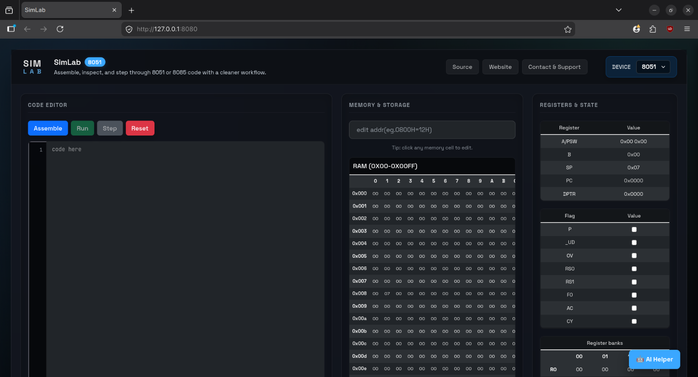

# SimLab (8051 & 8085 Simulator)

A modern, web-based simulator for 8051 and 8085 microprocessors built with Python (Flask) and a clean IDE-like web interface.

**Live Demo:** [SimLab](https://simlab.shaws.systems/)

## Features
- **Modern UI:** Clean, IDE-style 3-column layout optimized for both desktop and mobile devices.
- **Real-time Assembly & Execution:** Assemble code, track errors, run instantly, or step through your code line by line.
- **State Tracking:** Live updates of RAM, ROM, Registers, and Flags as your code executes.
- **Dual Support:** Toggle seamlessly between 8051 and 8085 instruction sets.
- **AI Helper:** Built-in Groq AI assistant to explain code and provide step-by-step tutoring.

## Usable Opcodes (Examples)
A large subset of standard opcodes are supported, including but not limited to:
`ADD`, `ANL`, `CJNE`, `CLR`, `CPL`, `DA`, `DEC`, `DJNZ`, `INC`, `JC`, `JNC`, `JNZ`, `JZ`, `MOV`, `ORG`, `ORL`, `POP`, `PUSH`, `RL`, `RR`, `SETB`, `SUBB`, `SJMP`, `AJMP`, `LJMP`, `JMP`, `JBC`.

*A full reference is available in the web interface's "Supported Opcodes" panel.*

---
**Credits:** Originally forked from [devanshshukla99/8051-Simulator](https://github.com/devanshshukla99/8051-Simulator), currently maintained and modernized by [Rohit K. Shaw](https://github.com/shawrhit).
